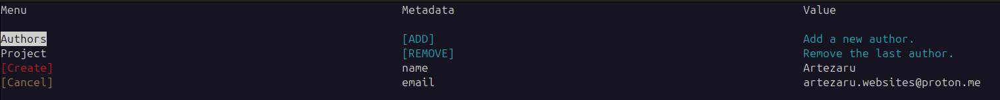
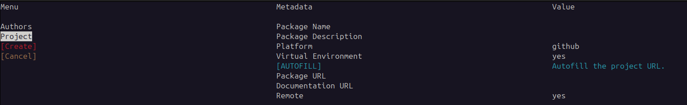

Quick Start
===========

Installation
------------

To get started quickly with the project, you can install it using the following command:

.. code-block:: bash

    pip install git+https://github.com/Artezar/pyprogen.git

Running the project
-------------------

On the command line, in the same python environment where you installed the package, move to the directory where you want to create the project and run the following command:

.. code-block:: bash

    cd /path/to/your/parent/directory
    pyprogen

This will open a CLI interface that will guide you through the project creation process.

The first menu of the CLI will help you to define the authors.

In this section, you must enter the **author's name** and **email address**.
To edit a field, navigate to it using the arrow keys and press **Enter** to input a new value.
At least one author is mandatory.
The author information is saved for future use, so you only need to enter it once unless you wish to update it.

The second menu of the CLI will help you to define the package settings.

In this section, you must enter the **project name**.
You can also add a short **description** of the project and choose if a **virtual environment** should be created.
Then if you want to push the project to a **git repository**, you can enter the **repository URL**.
If the repository has the same name as the project, you can use the command "AUTOFILL" to fill the repository URL and documentation URL fields automatically.
The parameter "remote" allows to remote the repository with the URL provided.
If the repository is not yet created, please set the parameter "remote" to "False" and refer to the section ``Remote Repository`` to create the repository (below).

If all is correct, the "CREATE" button will be enabled, and you can press "Enter" to create the project.

The structure of the project is presenteted in the section :doc:`project_structure`.

Remote Repository
-----------------

To remote your repository, first go to github.com or gitlab.com and create a new blank and empty (no README, no LICENSE, no .gitignore) repository.

Then go to the directory of your project and run the following commands:

.. code-block:: bash

    git remote add origin <repository_url>
    git push -u origin master
    git checkout gh-pages
    git push -u origin gh-pages
    git checkout master

