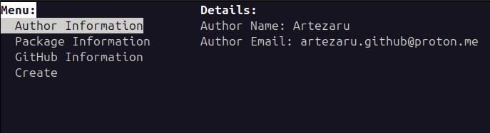
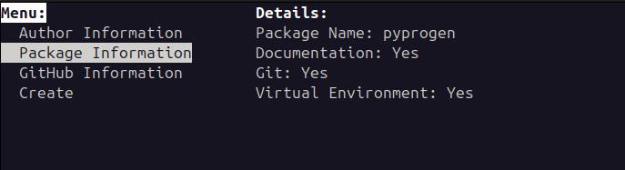
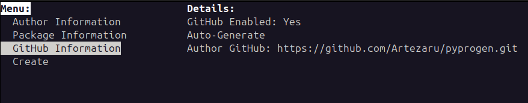

Quick Start
===========

To use pyprogen, install the package using pip:

.. code-block:: console

    pip install git+https://github.com/Artezaru/pyprogen.git

Then, you can use (in the same environment) the command line interface (CLI) to create a new Python project in the current directory.

.. code-block:: console

    pyprogen

This command will open the following CLI.
You can navigate through the different options with the arrow keys and select an option with the enter key.

The first section is ``Author Information``.

In this section, you can enter the author name and email. 
These fields are mandatory.
To change the value of a field, you can use the arrow keys to navigate to the field and press the enter key.
Then, a prompt will appear to enter the new value.
The ``Author Information`` section is saved for the next time you use the CLI. 
It is not necessary to enter this information every time you create a new project but only when you want to change it.

The second section is ``Package Information``.

In this section, you can enter the package name, and if you want to add a sphinx documentation, a git repository, an create a virtual environment.
The package name is mandatory, but the other fields are optional.
The documention, git and virtual environment fields are saved for the next time you use the CLI.
Only the package name is mandatory to enter every time you create a new project.

The last section is ``Github Information``.

In this section, you can enter the github repository link to connect the project to the repository.

.. warning::

    The github repository link must be an empty and existing repository.
    If the link is not valid, the project will not be connected to the repository and an error will be raised.

After entering all the information, the project will be created in the current directory with the ``Create`` button.
If you want to cancel the creation, you can press the ``Exit`` keyboard key.